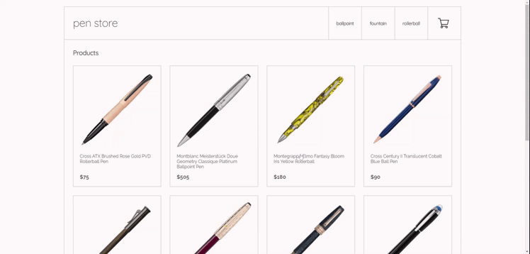

# pen store | ReactJS
### E-commerce Proyect

pen store is an e-commerce made with ReactJS for the CoderHouse's course

### Technologies used so far

- Good' ol plain CSS
- create-react-app
- Promises
- Hooks
- react-router

### Demo



### Installation

pen store requires [Node.js](https://nodejs.org/) v14+ to run.

Install the dependencies and devDependencies and start the project.

```sh
cd pen-store-react
npm install
npm start
```

Open [http://localhost:3000](http://localhost:3000) to view it in the browser.